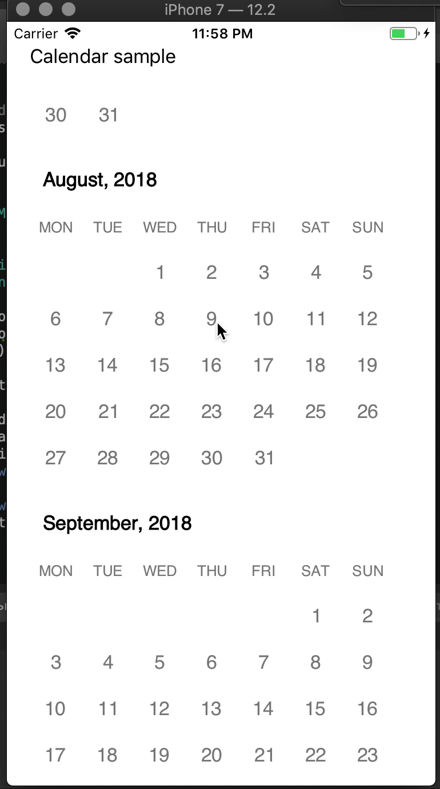
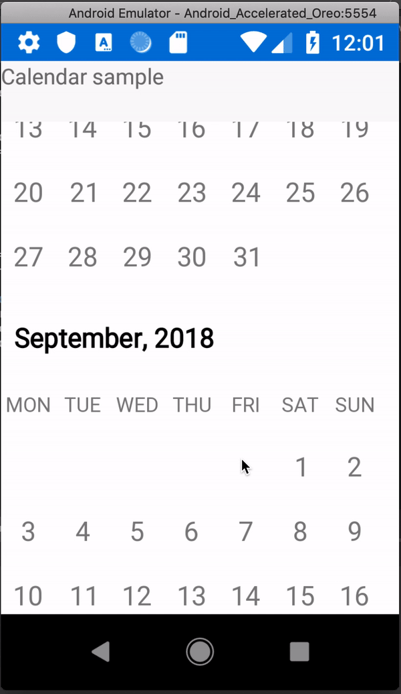

# Calendar View Sample
The sample view is based on a CollectionView control that comes out of box. 
Control supposed to replace original DatePicker and make it in a crossplatform way. Thats why i used SkiaSharp canvas view to draw a month as an ItemTemplate of a CollectionView.

To get or set currently selected date just bind it to FirstDate and LastDate Properties.
All of the cell styles could be customized in SkMonthView class.

 | 
